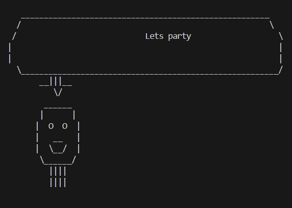

# Документація

## Ідея

Цей проект створює анімацію роботизованого персонажа, який ділиться своїми "мріями" у формі текстових повідомлень. Мрії виводяться в "хмарі" над головою робота, створюючи враження, що він думає про різні речі.

## Постановка задачі

Розробити однорядковий код, який виводить анімацію роботизованого персонажа, що генерує випадкові "мрії" з заздалегідь визначеного списку. Програма повинна показувати голову робота з "облачком" над ним, де з'являються його думки.

## Як скомпілювати/інтерпретувати та виконати код

1. Переконайтесь, що у вас встановлений Python (версія 3.x).
2. Скопіюйте наданий код у текстовий файл, наприклад `dreams.py`.
3. Відкрийте термінал і перейдіть до директорії, де зберігся файл.
4. Використовуйте команду `python dreams.py`, щоб запустити програму.

## Додаткові ресурси

# Documentation

## Idea

This project creates an animation of a robotic character that shares its "dreams" in the form of text messages. The dreams are displayed in a "cloud" above the robot's head, creating the impression that it is thinking about various things.

## Problem Statement

Develop a one-liner code that outputs an animation of a robotic character generating random "dreams" from a predefined list. The program should display the robot's head with a thought bubble above it, where its thoughts appear.

## How to Compile/Interpret and Run the Code

1. Make sure you have Python installed (version 3.x).
2. Copy the provided code into a text file, e.g., `dreams.py`.
3. Open a terminal and navigate to the directory where the file is saved.
4. Use the command `python dreams.py` to run the program.

## Additional Resources

